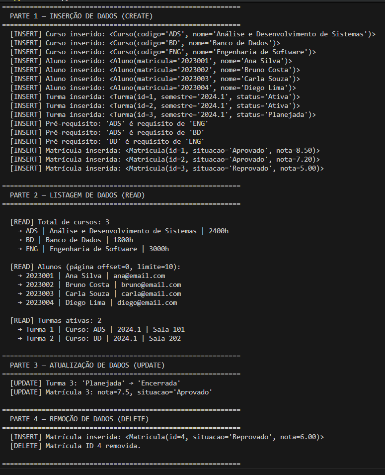
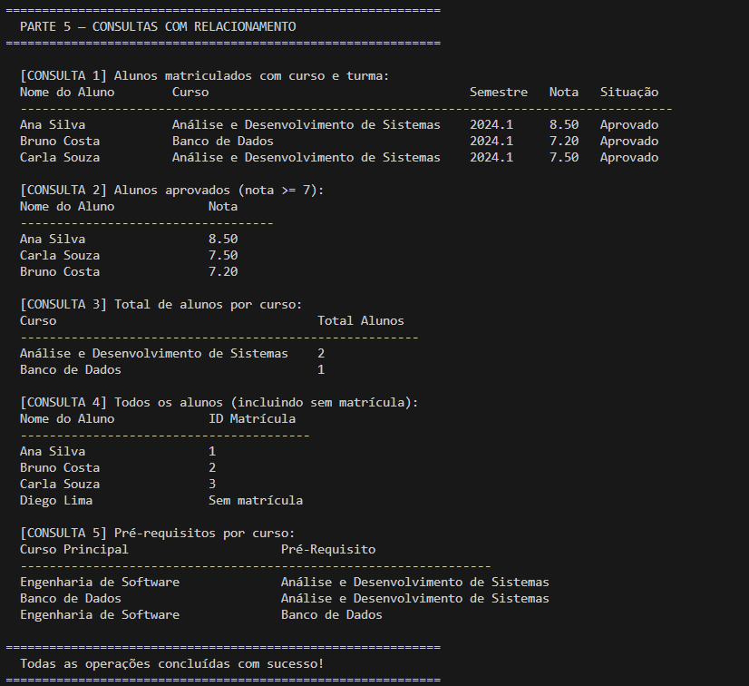

# Gerenciador de Cursos e Alunos — Etapa 7: ORM

**Instituição:** Universidade Federal do Cariri  
**Curso:** Análise e Desenvolvimento de Sistemas  
**Aluno:** Jefferson Rodrigues de Oliveira  
**Disciplina:** Projeto de Banco de Dados  
**Banco de Dados:** PostgreSQL  
**ORM utilizado:** SQLAlchemy 2.0 (Python)  
**Ferramenta:** DBeaver + VS Code  

---

## Sobre o Projeto

Este projeto implementa o acesso ao banco de dados **Gerenciador de Cursos e Alunos** utilizando ORM (Object-Relational Mapping) com SQLAlchemy. Todas as operações CRUD e consultas são realizadas via ORM, sem SQL manual na parte principal da aplicação.

O banco de dados foi construído nas etapas anteriores do projeto final, contendo as tabelas: `curso`, `aluno`, `turma`, `pre_requisito` e `matricula`.

---

## Estrutura do Projeto

```
files/
├── .env.example       # Modelo de variáveis de ambiente
├── .gitignore         # Arquivos ignorados pelo Git
├── requirements.txt   # Dependências Python
├── database.py        # Configuração da conexão com o PostgreSQL
├── models.py          # Mapeamento ORM (classes ↔ tabelas)
├── crud.py            # Operações CRUD via ORM
├── consultas.py       # Consultas com relacionamentos (JOIN via ORM)
├── main.py            # Ponto de entrada — executa todas as operações
├── prints/
│   ├── evidencia_crud.png        # Print das operações CRUD
│   └── evidencia_consultas.png   # Print das consultas com relacionamento
└── sql/
    ├── ProjetoFinal_ModeloFisico_GerenciadorCursosAlunos.sql
    ├── ProjetoFinal_Etapa3_GerenciadorCursosAlunos.sql
    ├── ProjetoFinal_Etapa4_Constraints_GerenciadorCursos.sql
    └── ProjetoFinal_Etapa5_RecursosAvancados_GerenciadorCursos.sql
```

---

## Mapeamento ORM

Cada tabela do banco foi mapeada como uma classe Python com seus relacionamentos:

| Classe         | Tabela          | Relacionamentos                     |
|----------------|-----------------|-------------------------------------|
| `Curso`        | `curso`         | 1-N com Turma, 1-N com PreRequisito |
| `Aluno`        | `aluno`         | 1-N com Matricula                   |
| `Turma`        | `turma`         | N-1 com Curso, 1-N com Matricula    |
| `PreRequisito` | `pre_requisito` | N-1 com Curso (duplo)               |
| `Matricula`    | `matricula`     | N-1 com Aluno, N-1 com Turma        |

---

## Pré-requisitos

- Python 3.10 ou superior
- PostgreSQL instalado e em execução
- Banco criado com o schema das etapas anteriores (pasta `sql/`)

---

## Como configurar

### 1. Instalar dependências

```bash
pip install -r requirements.txt
```

### 2. Configurar variáveis de ambiente

Copie o arquivo de exemplo:

```bash
cp .env.example .env
```

Edite o `.env` com suas credenciais:

```
DB_HOST=localhost
DB_PORT=5432
DB_NAME=gerenciador_cursos
DB_USER=postgres
DB_PASSWORD=sua_senha_aqui
```

### 3. Preparar o banco

Execute o script da etapa anterior no DBeaver para garantir que o banco está criado. Caso já tenha dados, limpe antes de rodar:

```sql
TRUNCATE TABLE matricula, pre_requisito, turma, aluno, curso RESTART IDENTITY CASCADE;
```

---

## Como executar

```bash
python main.py
```

---

## Operações implementadas

### CRUD (`crud.py`)
- **CREATE:** insere cursos, alunos, turmas, matrículas e pré-requisitos via ORM
- **READ:** listagem com ordenação e paginação (limit/offset)
- **UPDATE:** atualiza status de turma e nota/situação de matrícula
- **DELETE:** remove matrícula e aluno (com CASCADE automático)

### Consultas com relacionamento (`consultas.py`)
1. Alunos matriculados com nome do curso e semestre — JOIN entre 4 tabelas
2. Alunos aprovados com nota ≥ 7 — filtro em tabela relacionada
3. Total de alunos por curso — COUNT + GROUP BY via ORM
4. Todos os alunos incluindo sem matrícula — LEFT JOIN (outerjoin)
5. Pré-requisitos dos cursos — auto-referência via ORM

---

## Evidências de funcionamento

### CRUD — Partes 1, 2, 3 e 4


### Consultas com relacionamento — Parte 5


---

## Observações

- O arquivo `.env` não está versionado por conter dados sensíveis (senha do banco).
- Nenhuma query SQL manual foi utilizada no CRUD e consultas principais.
- Os relacionamentos são carregados via `joinedload` para maior eficiência.
